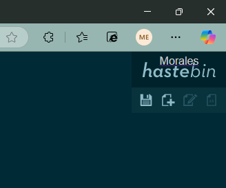

# Etapes pour construire et la lancer via Docker
Pour produire ce projet, j'ai produit ce fichier Dockerfile :
```Dockerfile
# Image Node.js comme base
FROM node:18-alpine

# Définir le répertoire de travail
WORKDIR /app

# Clôner le répertoire de hastebin
RUN apk add --no-cache git && \
git clone https://github.com/toptal/haste-server.git

# Passer dans le dossier de l'app clonée
WORKDIR /app/haste-server

# Copier les fichiers de configuration personnalisés
COPY settings/config.json ./config.js

# Et copipe de l'index.html personnalisés
COPY settings/index.html ./static/index.html

# Installer les dépendances npm
RUN npm install

# Exposer le port 8085
EXPOSE 8085

# Commande de démarrage de l'application
CMD [ "npm", "start" ]
```
Ce fichier contient toutes les étapes pour construire l'image pour lancer hastebin. On commence par utiliser une image node, on définir le répertoire de travail, on clône le répertoire officiel de hastebin. 
On continue par passer dans le dossier de l'app clonée, on copie les différents fichiers de configuration pour avoir nos personnalifications et on copie aussi l'index.html.
On installe les  dépendances npm, on expose le port demandé, dans ce cas le port 8085 et on fait les commandes de démarrage.

# Les personnalisations apportées 
Dans le fichier config.json, j'ai modifié ces 3 éléments :
```json
    "port": 8085,
    "keyLength": 5,
    "maxLength": 10,
```
pour respecter les personnalifications demandés. J'ai aussi modifié cette partie-là dans index.html pour avoir mon nom à la place du nom du prof : 
```css
style="padding: 10px; text-align: center; color: #ccc; font-family: sans-serif;">Morales</span></a>
```

# Des captures d’écran commentées.
Voici les différentes captures d'écran : \
La page principal :

Le port demandé :

Le nom personnalisé :
